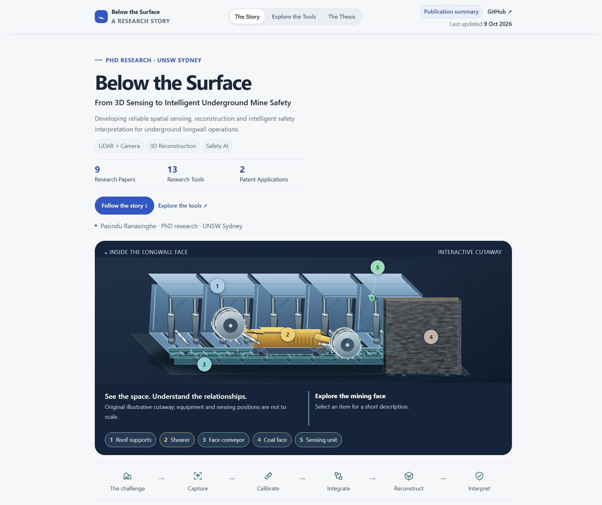

# Below the Surface - My PhD Story

I'm Pasindu Ranasinghe. My PhD at UNSW Sydney connects LiDAR-camera sensing,
colourised 3D reconstruction and safety interpretation for underground longwall
mining. I bring my research papers and software together through a visual,
interactive story.

My research asks how I can turn local sensor observations into reliable 3D
information and use it to understand relationships in a changing underground
workplace.

**[Explore my PhD story →](https://maninka123.github.io/my-phd-from-sensing-to-safety/)**

[](https://maninka123.github.io/my-phd-from-sensing-to-safety/)

## Explore my research

- **[The Story](https://maninka123.github.io/my-phd-from-sensing-to-safety/#story):** Follow my research from sensing to safety.
- **[The Tools](https://maninka123.github.io/my-phd-from-sensing-to-safety/#tools):** Explore 13 tools, their purposes and connections.
- **[The Thesis](https://maninka123.github.io/my-phd-from-sensing-to-safety/#thesis):** Browse my chapters and publications.

My portfolio includes **nine papers**: three published journal articles,
four journal manuscripts under review and two conference papers, plus **two
patent applications** listed separately. The website's publication summary
contains the paper details and journal metrics.

<details>
<summary>Run locally and find project files</summary>

I use a static website with no packages to install. With Node.js 20 or newer:

```sh
npm run dev
```

Local preview: **http://127.0.0.1:4173**.

```sh
npm run build
npm run check
```

| Folder | Contents |
| --- | --- |
| `src/` | Website content, interactions and styles |
| `public/assets/` | Figures and illustrations |
| `source-records/` | Publication data, sources and credits |
| `scripts/` | Build, preview and checks |
| `docs/` | Supporting documentation |

[Research map](docs/research-map.md) ·
[Sources and credits](source-records/README.md) ·
[Deployment guide](docs/deployment.md)

</details>
